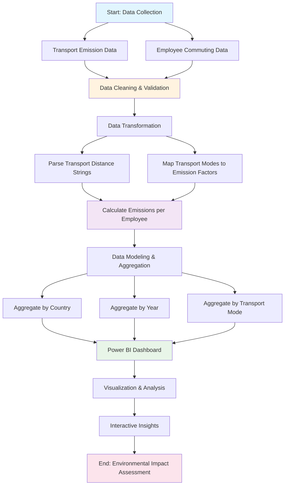
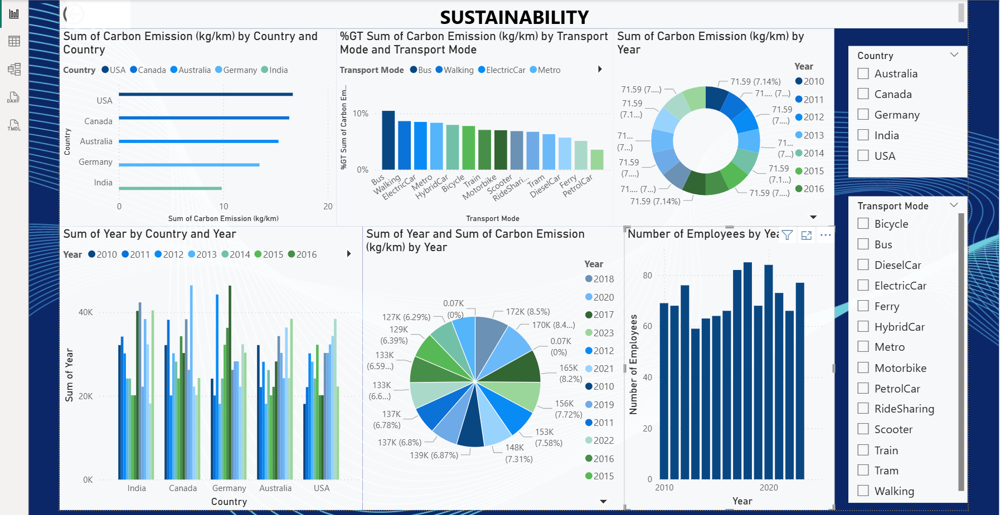

# 🌍 Employee Transport Carbon Emission Analysis

## 📌 Overview
This project analyzes carbon emissions generated by employee commuting patterns using different modes of transportation. It combines structured datasets with an interactive Power BI dashboard to provide insights into environmental impact.

---

## 🎯 Objectives
- Calculate carbon emissions based on transport type and distance
- Analyze employee commuting behavior across countries and years
- Identify eco-friendly vs high-emission transport methods
- Visualize insights using Power BI

---

## 📂 Project Structure

```
├── data/
│   ├── transport_emission.csv
│   └── employee_transport.csv
│
├── dashboard/
│   └── carbon_emission_dashboard.pbix
│
├── results/
│   └── Output.png
│
└── README.md
```


---

## 📊 Datasets Used

### 1. Transport Emission Dataset
Contains carbon emission values (kg/km) for different transport modes.

**Columns:**
- Country
- Transport Mode
- Carbon Emission (kg/km)

---

### 2. Employee Transport Dataset
Contains employee commuting details.

**Columns:**
- Employee Name
- Country
- Year
- Transport Used (distance per mode)

---

## ⚙️ Workflow



### Workflow Steps:
1. **Data Collection** - Gather transport emission factors and employee commuting data
2. **Data Cleaning** - Standardize formats and handle missing values
3. **Data Transformation** - Parse distance strings and map transport modes
4. **Emission Calculation** - Compute carbon emissions per employee
5. **Data Modeling** - Create relationships and aggregate data
6. **Dashboard Creation** - Build Power BI visualization
7. **Analysis** - Generate insights and recommendations

---

## 📈 Key Insights
- Identification of high-emission transport methods
- Comparison of eco-friendly alternatives
- Country-wise emission trends
- Impact of commuting patterns on environment

---

## � Output Analysis

### Dashboard Output


The dashboard provides comprehensive insights into employee transport carbon emissions, including:
- Total emissions overview
- Transport mode comparisons
- Country-wise emission patterns
- Temporal trends analysis

---

## �� Tools & Technologies
- Power BI
- CSV Data Processing
- Data Analysis Techniques

---

## 🚀 How to Use

1. Clone the repository:
   ```bash
   git clone https://github.com/your-username/your-repo-name.git
Open the Power BI file:
Navigate to /dashboard
Open .pbix file in Power BI Desktop
Explore the dashboard interactively


🤝 Contributing

Contributions are welcome! Feel free to fork this repo and submit a pull request.

---
